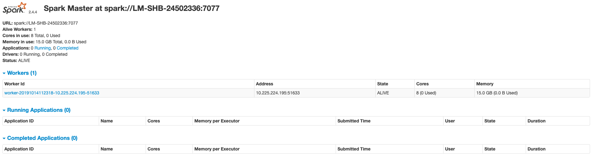

## Debug in IDEA

We will submit SparkPi to simple Spark Standalone Cluster(one master + one worker) in client deploy mode.
Utilize IDEA **Remote debugger**, we will go through the lifecycle of a spark applicaiton.

> Before we start, let's copy the original words from 《Learning Spark 2015》- CHAPTER 7 "Running on a Cluster".

To summarize the concepts in this section, let’s walk through the exact steps that occur when you run a Spark application on a cluster:
1. The user submits an application using spark-submit.
2. spark-submit launches the driver program and invokes the main() method specified by the user.
3. The driver program contacts the cluster manager to ask for resources to launch executors.
4. The cluster manager launches executors on behalf of the driver program.
5. The driver process runs through the user application. Based on the RDD actions and transformations in the program, the driver sends work to executors in the form of tasks.
6. Tasks are run on executor processes to compute and save results.
7. If the driver’s main() method exits or it calls SparkContext.stop(), it will termi‐ nate the executors and release resources from the cluster manager. 

#### Step1: clone source code and import into IDEA

``` bash
$ git clone git@github.com:apache/spark.git spark-source-code
$ cd spark-source-code

# default is master brach which is 3.0.0 version, checkout to branch-2.4
$ git checkout --track origin/branch-2.4  

# Open IDEA => Import project from existed source
```

> Spark is mainly written in Scala and you use different build tools like `maven`/`sbt`/`gradle`, we will use `maven` here.

Wait for IDEA downloaded all dependencies via maven ... 


#### Step2: configure IDEA Debugger

Then add four **Remote Debugger** like below (Run => Edit Configuration). 


You should set different and avaliable(not in bind already) ports for Debuggers to listen (default 5005). In our cases,
```
MasterDebugger => 5005
WorkerDebugger => 5006
DriverDebugger => 5007
ExecutorDebugger => 5008
```

Next, copy `conf/spark-env.sh.template` to a new environment variable configure file `conf/spark-env.sh` and add lines below to enable these Debuggers.

``` bash
# conf/spark-env.sh 

SPARK_MASTER_OPTS="-agentlib:jdwp=transport=dt_socket,server=y,suspend=n,address=5005 -Dspark.master.rest.enabled=true"
SPARK_WORKER_OPTS="-agentlib:jdwp=transport=dt_socket,server=y,suspend=n,address=5006"
SPARK_SUBMIT_OPTS="-agentlib:jdwp=transport=dt_socket,server=y,suspend=y,address=5007"

```

#### Step3: start a simple Spark Standalone Cluster

```
$ sbin/start-all.sh
starting org.apache.spark.deploy.master.Master, logging to /xxx/spark-2.4.4-bin-hadoop2.7/logs/spark-geluo-org.apache.spark.deploy.master.xxx.out
localhost: starting org.apache.spark.deploy.worker.Worker, logging to /xxx/spark-2.4.4-bin-hadoop2.7/logs/spark-geluo-org.apache.spark.deploy.worker.Worker-1-xxx.out

# access web UI of Spark Master at http://localhost:8080
```



#### Step4: submit SparkPi 

Start MasterDebugger and  WorkerDebugger in IDEA.

``` bash
$ ./bin/spark-submit --class org.apache.spark.examples.SparkPi \
                     --master spark://localhost:7077 \
                     --conf spark.executor.extraJavaOptions="-agentlib:jdwp=transport=dt_socket,server=y,suspend=n,address=5008" \
                     --executor-memory=2G --total-executor-cores=2 \
                     examples/jars/spark-examples_2.11-2.4.4.jar 20
Listening for transport dt_socket at address: 5007

# spark://localhost:7077 is the default master url(traditional RPC gateway) of Spark Master
# --deploy-mode default is client
# since we configure "suspend=y" only for DriverDebugger JVM parameter above, this app wouldn't lanuch until DriverDebugger started
```

> `bin/spark-submit` and `sbin/start-all.sh` will both call `bin/spark-class` inside

[lanuncher => java => Main](https://github.com/apache/spark/blob/branch-2.4/launcher/src/main/java/org/apache/spark/launcher/Main.java) is the entrance class used inside `bin/spark-class` to build cmd string.

> 可以发现 conf/spark-env.sh 中设定的2个环境变量, `SPARK_MASTER_OPTS` & `SPARK_WORKER_OPTS` 是生效的.

- For Spark Master, `java -cp 'xxx' -agentlib:jdwp=transport=dt_socket,server=y,suspend=n,address=5005 -Dspark.master.rest.enabled=true -Xmx1g org.apache.spark.deploy.master.Master --host LM-SHB-24502336 --port 7077 --webui-port 8080`.
- For Spark Worker, `java -cp 'xxx' -agentlib:jdwp=transport=dt_socket,server=y,suspend=n,address=5006 -Xmx1g org.apache.spark.deploy.worker.Worker --webui-port 8081 spark://LM-SHB-24502336:7077`.

> `SPARK_EXECUTOR_OPTS` 是无效的环境变量, 虽然它依旧保留在 `SparkClassCommandBuilder` switch-case 分支中，但是 executor 进程的启动不是通过 `bin/spark-class`, 如下 Work 日志中所示 .

```
19/10/10 21:56:05 INFO ExecutorRunner: Launch command: "java" "-cp" "/xxx/spark-2.4.4-bin-hadoop2.7/conf/:/xxx/spark-2.4.4-bin-hadoop2.7/jars/*" "-Xmx2048M" "-Dspark.driver.port=59711" "org.apache.spark.executor.CoarseGrainedExecutorBackend" "--driver-url" "spark://CoarseGrainedScheduler@192.168.0.7:59711" "--executor-id" "0" "--hostname" "192.168.0.7" "--cores" "2" "--app-id" "app-20191010215605-0000" "--worker-url" "spark://Worker@192.168.0.7:59617"
```

For `bin/spark-submit`, use `SparkSubmitCommandBuilder` instead of `SparkClassCommandBuilder` here. Build cmd result looks like: 
``` bash
java -cp 'xxx' -agentlib:jdwp=transport=dt_socket,server=y,suspend=y,address=5007 -Xmx1g org.apache.spark.deploy.SparkSubmit 
# same arguments which we pass to spark-submit above
--master spark://LM-SHB-24502336:7077 
--conf spark.executor.extraJavaOptions=-agentlib:jdwp=transport=dt_socket,server=y,suspend=n,address=5008 
--class org.apache.spark.examples.SparkPi 
--executor-memory 2G --total-executor-cores 2 
examples/jars/spark-examples_2.11-2.4.4.jar 20`. 

# SPARK_SUBMIT_OPTS works here too.
```

#### Step5: Ready !

You can set breakpoints in IDEA and start to debug source code of Spark now.

[core => scala => deploy => SparkSubmit](https://github.com/apache/spark/blob/branch-2.4/core/src/main/scala/org/apache/spark/deploy/SparkSubmit.scala) is the entrance class of `spark-submit`.
``` scala
// line 929
submit.doSubmit(args)


// line 76
def doSubmit(args: Array[String]): Unit = { 

  // 构造 SparkSubmitArguments 对象 ( 其过程中会进行参数验证 validateArguments() 等 )
  val appArgs = parseArguments(args)

  appArgs.action match {
    case SparkSubmitAction.SUBMIT => submit(appArgs, uninitLog)
    case SparkSubmitAction.KILL => kill(appArgs)
    case SparkSubmitAction.REQUEST_STATUS => requestStatus(appArgs)
    case SparkSubmitAction.PRINT_VERSION => printVersion()
  }

  // 默认为 SUBMIT action 即正常提交
  // --kill 和 --status 分别对应 KILL & REQUEST_STATUS action, 仅在 standalone + cluster mode 下生效, 并且后面的参数为submitted driver id(如下)而不是常规的application id
  // 19/10/15 12:46:41 INFO ClientEndpoint: Driver successfully submitted as driver-20191015124641-0000

  // --version 对应 PRINT_VERSION action 调用 printVersion() 方法
  // 当 没有参数 或 --help 或 无效参数时，都会调用 SparkSubmitArguments 的 printUsageAndExit() 方法打印用例说明并退出

// line 773
private def runMain(args: SparkSubmitArguments, uninitLog: Boolean): Unit = {
  // prepareSubmitEnvironment 其实做了很多事情 (比如, 检查指定的cluster manager和deploy mode是否为支持的组合, e.g. spark-shel 和 spark-sql 就不支持 cluster mode)
  // 虽然它最终只返回:
  // 1. Driver 的参数, e.g. 20
  // 2. Driver 的 classpath, e.g. /xxx/examples/jars/spark-examples_2.11-2.4.4.jar
  // 3. 从参数和全局的 properties 中获取并构造SparkConf(这是下一步构造SparkContext的必要参数)
  // 4. 包含 main 方法的入口类名 (如果是python application 或者cluster deploy mode，那该类名不同步--class所指定的), 
  //   e.g. standalone cluster mode 这里的类名将是 org.apache.spark.deploy.ClientApp 
  //   e.g. yarn cluster mode 这里的类名将是 org.apache.spark.deploy.yarn.YarnClusterApplication
  val (childArgs, childClasspath, sparkConf, childMainClass) = prepareSubmitEnvironment(args)
 
    // 利用反射调用 入口类(child class) 的 main 方法 
    app.start(childArgs.toArray, sparkConf) 

// core => scala => deploy => SparkApplication
// line 52
  val sysProps = conf.getAll.toMap
  sysProps.foreach { case (k, v) =>
    sys.props(k) = v
  }
  //利用 JVM System Property 传递配置项 e.g spark.master = spark://localhost:7077

  mainMethod.invoke(null, args)
```

[examples => scala => SparkPi](https://github.com/apache/spark/blob/branch-2.4/examples/src/main/scala/org/apache/spark/examples/SparkPi.scala), invoke main function of Driver program.
``` scala

object SparkPi {
  def main(args: Array[String]) {
    val spark = SparkSession
      .builder
      .appName("Spark Pi")
      .getOrCreate()
    // 构造 SparkSession, The entry point to programming Spark with the Dataset and DataFrame API.

    // parallelize 创建了一个 RDD 经过 map (转换--transformation) 和 reduce (动作--action)
    val count = spark.sparkContext.parallelize(1 until n, slices).map { i =>
      val x = random * 2 - 1
      val y = random * 2 - 1
      if (x*x + y*y <= 1) 1 else 0
    }.reduce(_ + _)
```

[sql => core => scala => SparkSession](https://github.com/apache/spark/blob/branch-2.4/sql/core/src/main/scala/org/apache/spark/sql/SparkSession.scala)
``` scala
// line 901
def getOrCreate(): SparkSession = synchronized {

// line 926
  val sparkContext = userSuppliedContext.getOrElse {

    // line 935
    // SparkSession 包含一个 SparkContext
    SparkContext.getOrCreate(sparkConf)

    // line 957
    session = new SparkSession(sparkContext, None, None, extensions)
...
// 回到上面的 Driver 程序
```

[core => scala => SparkContext](https://github.com/apache/spark/blob/branch-2.4/core/src/main/scala/org/apache/spark/SparkContext.scala)
``` scala
// line 2520
// 如果找不到一个 active context (最多只有一个), 则构造一个新的 Spark Context
if (activeContext.get() == null) {
  setActiveContext(new SparkContext(config), allowMultipleContexts = false)

// line 424
// 构造 SparkEnv, Holds all the runtime environment objects for a running Spark instance (either master or worker),
// including the serializer, RpcEnv, block manager, map output tracker, etc.
  _env = createSparkEnv(_conf, isLocal, listenerBus)

// line 452
  // 启动 WebUI
  _ui.foreach(_.bind())
  // 19/10/15 13:47:14 INFO Utils: Successfully started service 'SparkUI' on port 4040.
  // 19/10/15 13:47:15 INFO SparkUI: Bound SparkUI to 0.0.0.0, and started at http://lm-shb-24502336.paypalcorp.com:4040 

// line 493
  // 构造 ScheduleBackend & TaskScheduler
  val (sched, ts) = SparkContext.createTaskScheduler(this, master, deployMode)
  // 构造 DAGScheduler
  _dagScheduler = new DAGScheduler(this)

  // 启动 TaskScheduler & ScheduleBackend (TaskScheduler包含一个ScheduleBackend和DAGScheduler的引用--reference)
  _taskScheduler.start()
  // 启动之后, Spark Master Web UI http://localhost:8088 Running Application 可以看到 SparkPi 的 RUNNING State 的记录

  // BlockManager
  _env.blockManager.initialize(_applicationId)

  // MetricSystem
  _env.metricsSystem.start()

  // Dynamic Allocation 
  val dynamicAllocationEnabled = Utils.isDynamicAllocationEnabled(_conf)
  // 未开启 None
  _executorAllocationManager.foreach(_.start())

...

// SparkContext 构造完了, 回到上面的 SparkSession 构造过程
```
